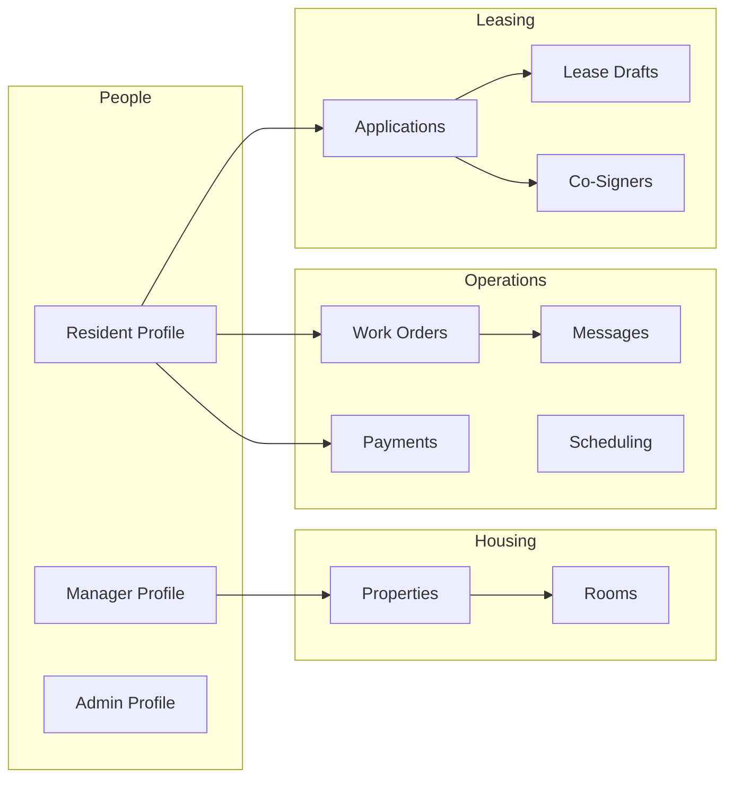

# Airtable base — schema & layout prompt

Use this document when you want a **clear picture of how the Axis (`the-axis`) Airtable base should look**: one base, which tables exist, how they link, field types, and **single-select options** the app expects. Paste sections into Cursor or another assistant to **design, audit, or migrate** your base.

**Authoritative detail for every field name:** `docs/AIRTABLE_SETUP_PROMPT.md` (sections 1–2).  
**Env:** single base `VITE_AIRTABLE_BASE_ID` (+ server `AIRTABLE_BASE_ID` same value); token `VITE_AIRTABLE_TOKEN`.

---

## 1) One base, many tables

Everything below lives in **the same Airtable base** (not separate bases per feature).



---

## 2) Tables to create (names)

| Table | Purpose (short) |
|-------|------------------|
| `Resident Profile` | Portal login, profile, links to house, applications, payments |
| `Manager Profile` | Manager auth, scope, tour availability text |
| `Admin Profile` | Internal admin login (if used) |
| `Properties` | Approved listings, manager linkage, fees, tour notes |
| `Rooms` | Optional per-room rent (links to Properties) |
| `Work Orders` | Resident requests + manager workflow (Open → Scheduled → Completed) |
| `Messages` | Threads (work orders + portal inbox); `Thread Key`, `Channel` |
| `Inbox Thread State` | Optional per-manager read/trash sync for inbox |
| `Announcements` | Resident feed + composer |
| `Payments` | Rent and fee lines |
| `Documents` | Resident-visible files |
| `Packages` | Package tracking |
| `Scheduling` | Tour/meeting bookings (manager calendar) |
| `Applications` | Full apply pipeline |
| `Co-Signers` | Linked to Applications |
| `Lease Drafts` | AI + manager lease workflow, SignForge ids |
| `Audit Log` | Lease/workflow audit rows |
| `Website Settings` | Declared in code; optional / low priority |

---

## 3) How **`Work Orders`** should look (portal workflow)

The manager and resident portals share this lifecycle:

1. **Created** — Status should be **`Open`** (recommended single-select option). If your base only has legacy values, the app may create **`Submitted`** and still **display “Open”** to users.
2. **In review** — **`In Progress`** (optional; stays in the **Open** filter until a visit date exists).
3. **Visit scheduled** — Manager sets a **scheduled visit date** (and optional time window). The app saves:
   - Structured lines inside **`Management Notes`** (`scheduled date: YYYY-MM-DD`, `scheduled time: …`), and
   - **`Scheduled Date`** (date field) **if the column exists** (recommended).
   - Status becomes **`Scheduled`** when a date is set.
4. **Done** — Manager marks **`Completed`**, sets **`Resolved`** checkbox true, fills **`Resolution Summary`** as needed.

**Recommended `Status` (single select) options** (typecast-friendly; add any your ops still need):

- `Open`
- `Submitted` (legacy; treat as Open in UI)
- `In Progress`
- `Scheduled`
- `Completed`
- (Optional legacy: `Resolved`, `Closed` — app maps resolved/completed similarly)

**Core columns (minimum):**

| Field | Type | Notes |
|-------|------|--------|
| `Title` | Single line text | |
| `Description` | Long text | |
| `Category` | Single line text | |
| `Priority` | Single select | e.g. Low / Medium / Urgent |
| `Status` | Single select | See options above |
| `Preferred Entry Time` | Single line text | |
| `Resident profile` | Link → Resident Profile | Exact name may vary; see env `VITE_AIRTABLE_WORK_ORDER_RESIDENT_LINK_FIELD` |
| `Property Name` | Single line text | Plain name for manager scope |
| `House` / `Property` | Link → Properties | Optional; used when present |
| `Photo` | Attachment | |
| `Date Submitted` | Created time | |
| `Management Notes` | Long text | Internal; may contain `key: value` lines for schedule meta |
| `Update` | Long text | Resident-visible thread-style updates |
| `Resolution Summary` | Long text | Completion note to resident |
| `Resolved` | Checkbox | |
| `Last Update` | Date | |
| **`Scheduled Date`** | Date | **Recommended** for calendar + clarity (app retries without if missing) |
| `Resident Email` | Email or text | Often a lookup from resident |

---

## 4) How **`Payments`** should look (high level)

- Link **`Resident`** → Resident Profile  
- Money: **`Amount`**, **`Due Date`**, **`Paid Date`**, balance-style fields as in `AIRTABLE_SETUP_PROMPT.md` §1.8  
- Labels: **`Property Name`**, **`Room Number`**, **`Type`**, **`Category`**, **`Status`**, **`Month`**

---

## 5) How **`Lease Drafts`** should look (high level)

- Identity: **`Resident Name`**, **`Resident Email`**, **`Resident Record ID`**, **`Property`**, **`Unit`**
- Terms: **`Lease Start Date`**, **`Lease End Date`**, **`Rent Amount`**, **`Deposit Amount`**, **`Utilities Fee`**, **`Lease Term`**
- Content: **`AI Draft Content`**, **`Manager Edited Content`**, **`Manager Notes`**
- **`Status`** — pipeline includes e.g. Draft Generated, Under Review, Published, Signed (see full list in `AIRTABLE_SETUP_PROMPT.md` §1.11)
- SignForge: **`SignForge Envelope ID`**, **`SignForge Sent At`**
- **`Updated At`**, **`Application Record ID`**, audit-friendly ids

---

## 6) How **`Scheduling`** should look (calendar)

Used for tours/meetings and read by the manager calendar UI:

| Field | Type |
|-------|------|
| `Name`, `Email`, `Phone` | Text |
| `Type` | Single select (e.g. Tour, Meeting) |
| `Status` | Single select |
| `Property`, `Room` | Text |
| `Preferred Date`, `Preferred Time` | Date / text |
| `Notes` | Long text |

Work orders with a **`Scheduled Date`** (or schedule meta) appear as **separate calendar rows** derived in the app — they are **not** required to duplicate into `Scheduling`.

---

## 7) Copy-paste prompt (for an AI designing the base)

```text
Design or verify ONE Airtable base for the Axis web app (the-axis repo).

Constraints:
- Single base ID used everywhere: VITE_AIRTABLE_BASE_ID.
- Create tables: Resident Profile, Manager Profile, Properties, Rooms (optional), Work Orders, Messages, Announcements, Payments, Documents, Packages, Scheduling, Applications, Co-Signers, Lease Drafts, Audit Log. Optional: Inbox Thread State, Website Settings.

Work Orders must support this lifecycle:
  Open (or Submitted legacy) → optional In Progress → Scheduled (requires a visit date) → Completed with Resolved checked.
  Add field Scheduled Date (date). Status single select should include at least: Open, Submitted, In Progress, Scheduled, Completed.
  Management Notes may store structured lines: "scheduled date: YYYY-MM-DD" and "scheduled time: …".

Link Work Orders to Resident Profile. Copy Property Name / property link from resident on create when possible.

Payments: link to Resident; Due Date; rent/fee categorization fields per AIRTABLE_SETUP_PROMPT.md.

Lease Drafts: resident/property fields + Status pipeline + SignForge envelope fields + AI/manager content fields per AIRTABLE_SETUP_PROMPT.md.

Messages: support Thread Key + Channel (include option internal_mgmt_admin for portal inbox).

Output:
1) Table list with exact table names.
2) Per table: field name, Airtable field type, required/optional, linked table if any.
3) Single-select option sets for Status/Priority/Type fields.
4) Gaps vs the repo (anything the app expects but is optional via env).
```

---

## 8) Related files

| File | Role |
|------|------|
| `docs/AIRTABLE_SETUP_PROMPT.md` | Full field lists and env overrides |
| `docs/airtable-portal-schema.txt` | Older machine-readable schema snapshot |
| `frontend/src/lib/airtable.js` | Table names and API usage |
| `frontend/src/lib/workOrderShared.js` | Work order schedule parsing from notes + fields |
